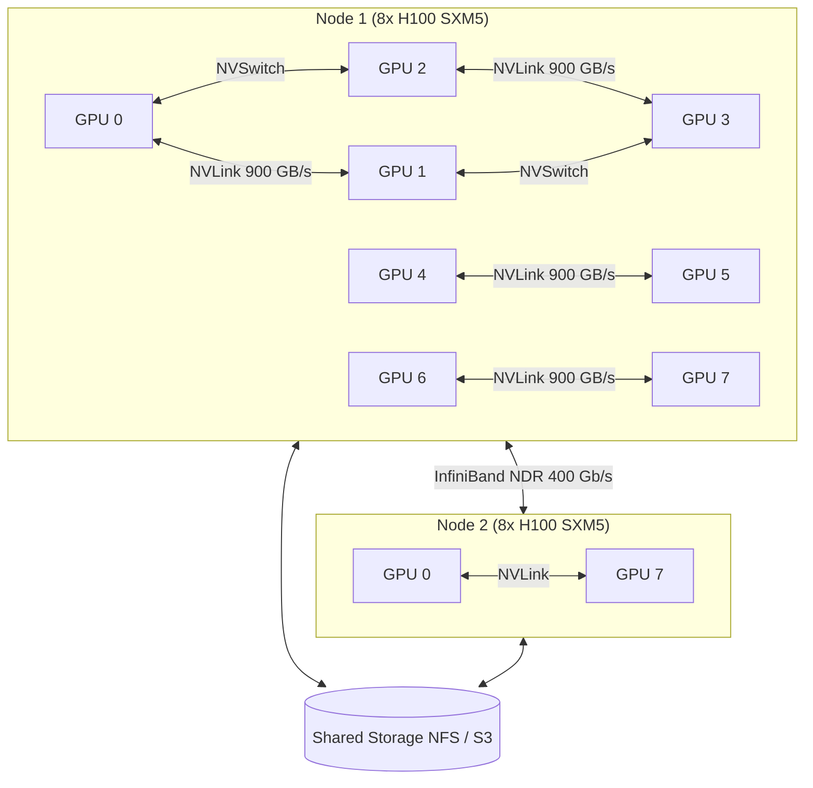
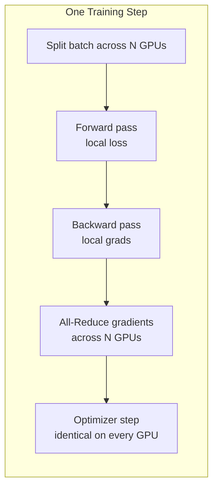
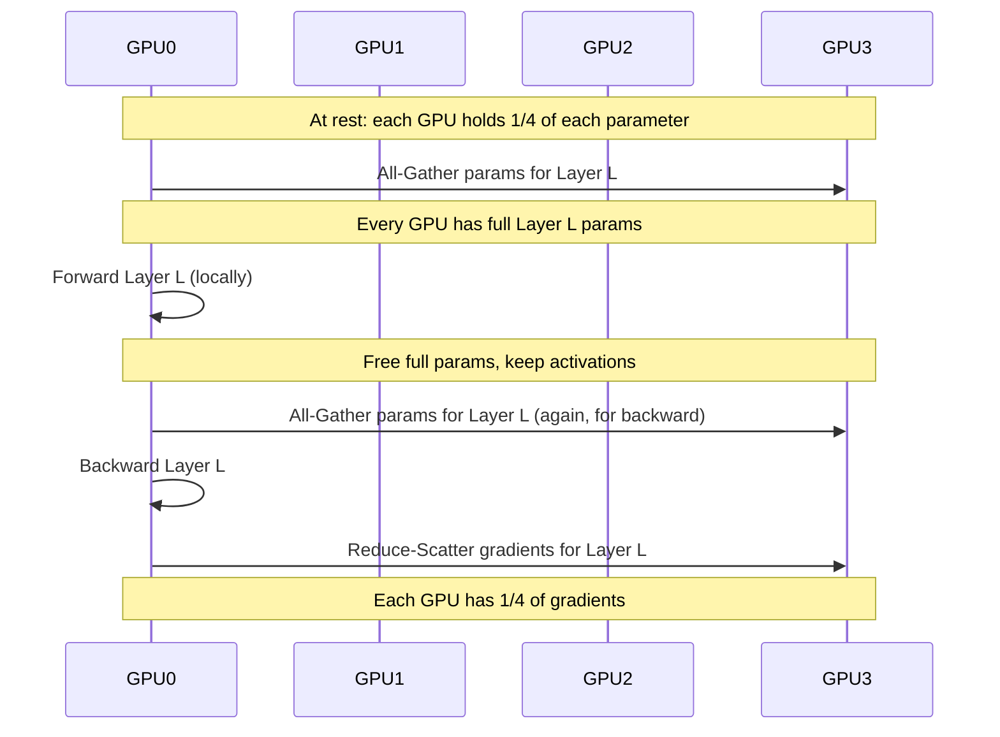
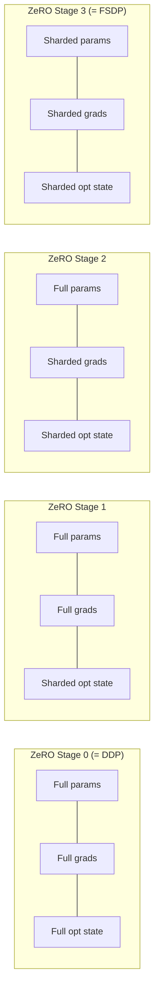
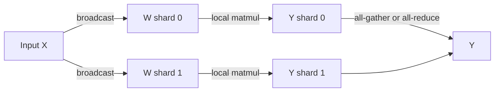
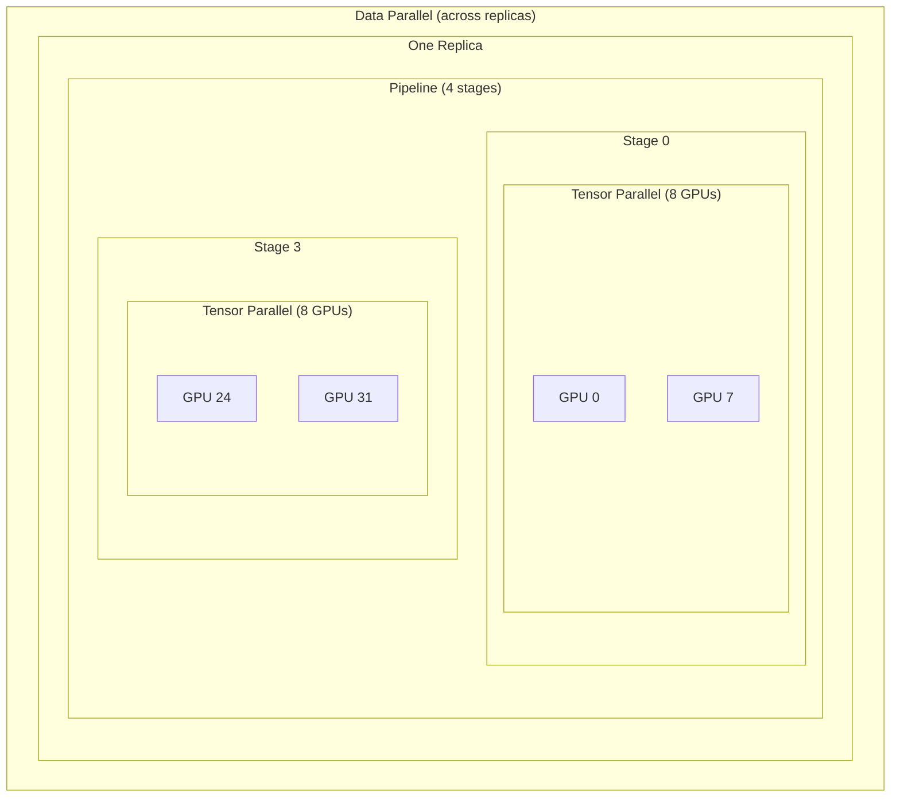
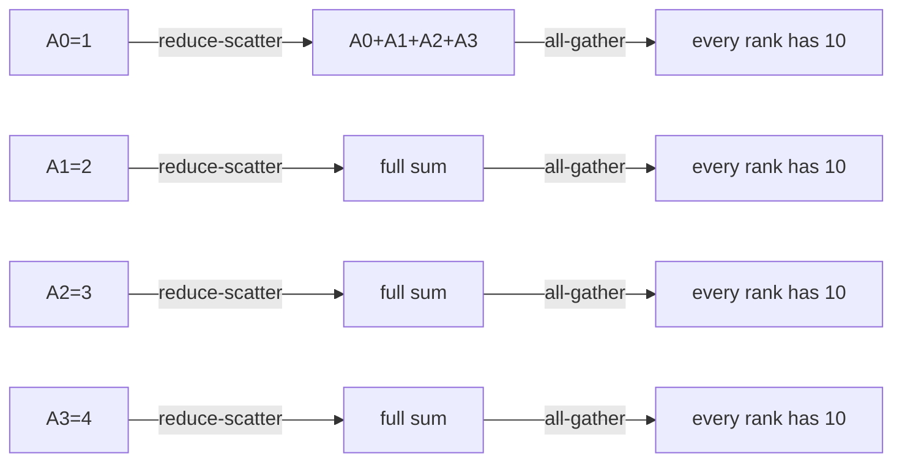
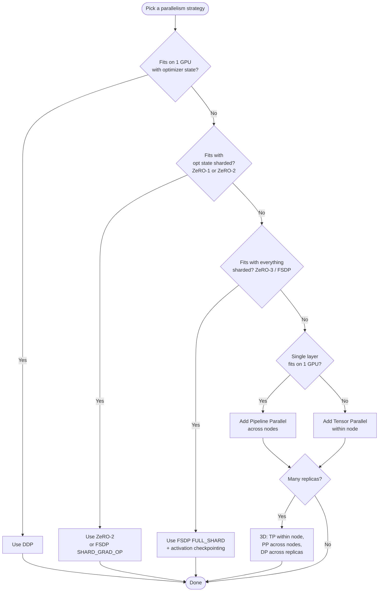

# Distributed Training Architecture

> Design overview for the Project 201 training platform. Covers parallelism
> strategies (DDP, FSDP, DeepSpeed ZeRO, TP+PP), memory math, communication
> patterns, and the NCCL fundamentals that make them work. Targeted at engineers
> who need to *choose* a strategy, not just run one.

## Table of Contents

1. [System Topology](#system-topology)
2. [Parallelism Strategies Overview](#parallelism-strategies-overview)
3. [Data Parallelism: DDP](#data-parallelism-ddp)
4. [Sharded Data Parallelism: FSDP](#sharded-data-parallelism-fsdp)
5. [DeepSpeed ZeRO Stages](#deepspeed-zero-stages)
6. [Model Parallelism: Tensor + Pipeline](#model-parallelism-tensor--pipeline)
7. [3D Parallelism](#3d-parallelism)
8. [Memory Math: Choosing a Strategy](#memory-math-choosing-a-strategy)
9. [Communication Patterns](#communication-patterns)
10. [NCCL Fundamentals](#nccl-fundamentals)
11. [Decision Tree](#decision-tree)

---

## System Topology

The reference deployment is 4-16 GPU nodes connected by 200/400 Gbps InfiniBand,
orchestrated by Ray on Kubernetes. The relevant boundaries are:



**Bandwidth hierarchy** (real-world H100 system):

| Link | Bandwidth | Latency |
|------|-----------|---------|
| HBM3 within GPU | 3.35 TB/s | ~100 ns |
| NVLink 4.0 (intra-node) | 900 GB/s bidir | ~1 µs |
| NVSwitch (intra-node, any-to-any) | 900 GB/s | ~1 µs |
| InfiniBand NDR (inter-node) | 50 GB/s unidir | ~2 µs |
| Ethernet 100 Gb (fallback) | 12 GB/s | ~10 µs |
| Network filesystem | 1-10 GB/s | ms range |

The 18-50x bandwidth gap between NVLink and InfiniBand is the single most
important constraint when choosing a parallelism strategy.

---

## Parallelism Strategies Overview

| Strategy | Memory per GPU | Compute Overhead | Comm per Step | Best For |
|----------|----------------|------------------|---------------|----------|
| DDP | Full model | None | 1x all-reduce(params) | Models that fit on 1 GPU |
| FSDP / ZeRO-3 | Model / N | +10-20% | all-gather + reduce-scatter | Models 1-10x GPU memory |
| DeepSpeed ZeRO-1 | Model + grads | None | reduce-scatter(grads) | Optimizer state too large |
| DeepSpeed ZeRO-2 | Model | +5% | reduce-scatter(grads+opt) | Mid-size models |
| Tensor Parallel (TP) | Model / TP | High intra-layer comm | all-reduce per layer | Single layer too big |
| Pipeline Parallel (PP) | Model / PP | Bubble overhead | point-to-point | Many layers, slow network |
| 3D (TP+PP+DP) | Smallest | All of the above | Mixed | Frontier models (>100B) |

---

## Data Parallelism: DDP

PyTorch DistributedDataParallel (DDP) replicates the full model on every GPU
and synchronizes gradients via all-reduce.



**Key properties**:

- Every GPU holds: params (P), grads (P), optimizer state (typically 2P for
  Adam moments + 2P FP32 master copy = 4P with mixed precision).
- Memory per GPU = `P + P + 4P = 6P` for AdamW + activations.
- Comm volume per step = `2 * P * (N-1)/N` (ring all-reduce).
- Scales near-linearly until `step_time < comm_time`, typically up to 8-32 GPUs
  for transformer pretraining on a fast network.

**Implementation** (project uses `torch.nn.parallel.DistributedDataParallel` via
Ray Train):

```python
from torch.nn.parallel import DistributedDataParallel as DDP
model = DDP(model.to(local_rank),
            device_ids=[local_rank],
            bucket_cap_mb=25,                 # 25 MB grad buckets overlap with compute
            gradient_as_bucket_view=True,     # save memory copies
            static_graph=True)                # fuse comm on iter 2+
```

**When DDP is right**: model + optimizer + activations fit on one GPU with
headroom. For BF16 AdamW on an H100 80GB: model up to ~10B params (10B * 6 bytes
amortized + activations).

---

## Sharded Data Parallelism: FSDP

Fully Sharded Data Parallel (FSDP) shards parameters, gradients, and optimizer
state across GPUs. Each GPU holds only `1/N` of each tensor at rest;
materialization happens just-in-time around the forward and backward passes.



**Memory math** for a P-parameter model with AdamW in mixed precision:

| Component | DDP | FSDP |
|-----------|-----|------|
| Params (BF16) | 2P | 2P/N |
| Grads (BF16) | 2P | 2P/N |
| Master params (FP32) | 4P | 4P/N |
| Adam moments (FP32) | 8P | 8P/N |
| **Total persistent** | **16P** | **16P/N** |
| Peak transient (FSDP only) | - | 2P (one layer's full params) |

For Llama-2 70B on 8 H100 80GB:

- DDP: 16 * 70B = 1120 GB. Doesn't fit. Period.
- FSDP: 16 * 70B / 8 + 2 * (largest layer params) ≈ 140 GB + ~5 GB ≈ fits with
  activation checkpointing.

**Comm cost**: 1.5x DDP per step (one all-gather + one reduce-scatter per layer
in backward, vs. one all-reduce per backward).

---

## DeepSpeed ZeRO Stages

ZeRO is a family of memory optimizations. Each stage shards a different
component:



| Stage | Memory per GPU | Extra Comm vs DDP | Notes |
|-------|----------------|--------------------|-------|
| 0 | 16P | 0 | Identical to DDP |
| 1 | 4P + 12P/N | 0 (still reduce-scatter on grads + all-gather updates, but balanced vs DDP all-reduce) | Cheapest win if opt state is the bottleneck |
| 2 | 2P + 14P/N | ~0 | Most common production choice for ~1-30B models |
| 3 | 16P/N | +50% (all-gather params twice per step) | Required for 30B+ on single nodes |

**ZeRO-Infinity** extensions:

- `offload_optimizer.device: cpu` -- optimizer state on CPU RAM. PCIe Gen4 x16
  = 32 GB/s; tolerable if step time dominates copy time.
- `offload_optimizer.device: nvme` -- optimizer state on local NVMe. Requires
  >2 GB/s sustained random write per GPU.
- `offload_param.device: cpu` -- only when even shards don't fit; expect 2-3x
  step time inflation.

---

## Model Parallelism: Tensor + Pipeline

When a single layer's parameters exceed one GPU's memory (e.g., Megatron-style
attention with hidden=12288, 96 heads), data parallelism is insufficient.

### Tensor Parallelism (TP)

Splits matrix multiplications across GPUs. For `Y = X @ W` with `W` partitioned
column-wise across `t` GPUs:



- Comm cost: 1 all-reduce per transformer block (forward) + 1 per block
  (backward) = `~4 * batch * seq * hidden * 2 / N` bytes per layer.
- This is *intra-layer*, so must run over the **fastest** interconnect.
  Megatron-LM's golden rule: **TP only within a node** (NVLink/NVSwitch).
  Crossing InfiniBand for TP destroys throughput.

### Pipeline Parallelism (PP)

Splits the model by layer ranges across stages. Each microbatch flows through
all stages.

```mermaid
gantt
    title GPipe Schedule (4 stages, 4 microbatches)
    dateFormat X
    axisFormat %s
    section Stage 0
    F0 :0, 1
    F1 :1, 2
    F2 :2, 3
    F3 :3, 4
    B3 :11, 12
    B2 :12, 13
    B1 :13, 14
    B0 :14, 15
    section Stage 1
    F0 :1, 2
    F1 :2, 3
    F2 :3, 4
    F3 :4, 5
    B3 :10, 11
    B2 :11, 12
    B1 :12, 13
    B0 :13, 14
    section Stage 2
    F0 :2, 3
    F1 :3, 4
    F2 :4, 5
    F3 :5, 6
    B3 :9, 10
    B2 :10, 11
    B1 :11, 12
    B0 :12, 13
    section Stage 3
    F0 :3, 4
    F1 :4, 5
    F2 :5, 6
    F3 :6, 7
    B3 :7, 9
    B2 :9, 10
    B1 :10, 11
    B0 :11, 12
```



**Bubble** = idle GPU time at pipeline fill/drain. With `p` stages and `m`
microbatches, bubble fraction = `(p - 1) / (m + p - 1)`. To keep bubble < 10%,
use `m >= 9 * (p-1)`.

Better schedules: **1F1B** (interleaved forward/backward, used in Megatron) and
**zero-bubble pipeline** (Sun et al. 2024).

---

## 3D Parallelism

Combines all three axes. Used for frontier-scale models (GPT-4, Llama-3 405B).



**Example sizing** for Llama-3 70B on 64 H100s:

- TP=8 (within node, all-reduce over NVSwitch)
- PP=2 (cross-node point-to-point, light traffic)
- DP=4 (replicas, all-reduce over IB)
- Total = 8 × 2 × 4 = 64 GPUs ✓

The orthogonal placement is critical:

1. TP must stay within NVLink islands.
2. PP point-to-point messages tolerate IB latency.
3. DP all-reduce is the only large cross-node comm; overlaps with PP bubble.

---

## Memory Math: Choosing a Strategy

For a model with `P` parameters trained in mixed precision with AdamW:

```
memory_per_gpu = params_bytes + grads_bytes + opt_bytes + activations_bytes

params:       2P (BF16)
grads:        2P (BF16)
opt (AdamW):  4P (FP32 master) + 4P (m) + 4P (v) = 12P
activations:  depends on sequence length, batch, layers, hidden
              ≈ 12 * batch * seq * hidden * num_layers * (1 / checkpoint_ratio)
```

**Worked example** -- 13B model, batch=4 per GPU, seq=4096, hidden=5120,
layers=40, full activation checkpointing (ratio=1/√layers):

| Item | Bytes | Per GPU (DDP, 1 GPU) | Per GPU (ZeRO-2, 8 GPU) | Per GPU (FSDP, 8 GPU) |
|------|-------|----------------------|--------------------------|------------------------|
| Params | 2P = 26 GB | 26 | 26 | 3.25 |
| Grads | 2P = 26 GB | 26 | 3.25 | 3.25 |
| Opt | 12P = 156 GB | 156 | 19.5 | 19.5 |
| Activations | ~5 GB | 5 | 5 | 5 |
| **Total** | | **213 GB** | **53.75 GB** | **31 GB** |
| Fits on H100 80GB? | | **NO** | **YES** | **YES + headroom** |

For 70B on 8x H100 80GB: only FSDP/ZeRO-3 fits, and only with activation
checkpointing.

---

## Communication Patterns

The three collectives that matter for distributed training:

### All-Reduce

Every rank contributes a tensor; every rank gets the sum. Used by DDP for grads.



Ring all-reduce: `2 * (N-1)/N * tensor_size` bytes per rank, `2 * (N-1)` steps.

### Reduce-Scatter

Every rank contributes; each rank gets a different slice of the sum. Used by
ZeRO and FSDP for gradients.

- Cost: `(N-1)/N * tensor_size` bytes per rank.
- Half the volume of all-reduce.

### All-Gather

Each rank has a slice; every rank ends up with the concatenation. Used by FSDP
to materialize full parameters before forward.

- Cost: `(N-1)/N * tensor_size` bytes per rank.

**The FSDP trick**: `all-reduce = reduce-scatter + all-gather`, so FSDP "splits"
the all-reduce in time and reuses the all-gather for parameter materialization.

---

## NCCL Fundamentals

NCCL (NVIDIA Collective Communications Library) is the transport for all
intra-job GPU-to-GPU communication.

### Algorithm Selection

NCCL picks between **Ring** and **Tree** topologies based on message size and
network:

- **Ring**: bandwidth-optimal for large messages. `O(N)` latency in hops.
- **Tree**: latency-optimal for small messages. `O(log N)` hops.
- **CollNet**: SHARP-accelerated reduction in the switch (requires Mellanox
  Quantum-2 or NVSwitch4 with SHARPv3). Eliminates the bandwidth ceiling
  imposed by individual NICs.

NCCL crossover thresholds (typical):

```
< 64 KB:    Tree
64 KB - 1 MB: depends on N
> 1 MB:     Ring
```

Override with `NCCL_ALGO=Ring,Tree,CollNet` and `NCCL_PROTO=Simple,LL,LL128`.

### Bus Bandwidth vs Algorithm Bandwidth

- **Algorithm bandwidth**: `tensor_size / time` -- what your code experiences.
- **Bus bandwidth**: hardware-equivalent throughput; `2 * (N-1)/N *
  algorithm_bandwidth` for all-reduce. Compare to physical link bandwidth.

H100 NVSwitch can sustain ~450 GB/s of all-reduce bus bandwidth across 8 GPUs.
HDR-IB (200 Gb) gives ~22 GB/s. NDR-IB (400 Gb) gives ~45 GB/s.

### GPU Direct RDMA

NCCL bypasses the CPU for cross-node transfers when:
1. NIC and GPU are on the same PCIe root complex (or NVSwitch with NVLink-IB),
2. `NCCL_NET_GDR_LEVEL` >= 3 (PHB or PIX),
3. The Mellanox OFED driver and `nvidia_peermem` kernel module are loaded.

Verify with `NCCL_DEBUG=INFO`: look for `Channel 00/0 : ... [send] via NET/IB/0/GDRDMA`.

### Tuning Knobs (Project Defaults)

```bash
# Topology
export NCCL_TOPO_FILE=/etc/nccl-topo.xml          # generated per cluster

# Transport
export NCCL_IB_DISABLE=0
export NCCL_IB_HCA=mlx5_0,mlx5_1,mlx5_2,mlx5_3   # one HCA per GPU pair on H100
export NCCL_IB_GID_INDEX=3                        # RoCE v2
export NCCL_NET_GDR_LEVEL=5

# Tuning
export NCCL_MIN_NCHANNELS=4
export NCCL_BUFFSIZE=8388608                      # 8 MB

# Debug (disable for production)
# export NCCL_DEBUG=INFO
# export NCCL_DEBUG_SUBSYS=ALL
```

---

## Decision Tree



**Concrete recommendations**:

| Model Size | Hardware | Recommended Strategy |
|------------|----------|----------------------|
| < 1B (ResNet, BERT-base) | 1-8 A100 | DDP |
| 1-7B (BERT-large, T5-3B) | 8-32 A100 | DDP or ZeRO-1 |
| 7-30B (Llama-7B, GPT-J) | 8 H100 / 1 node | FSDP FULL_SHARD + activation ckpt |
| 30-100B (Llama-70B) | 8-16 H100 / 1-2 nodes | FSDP + CPU offload, or ZeRO-3 + TP=8 |
| 100B-1T (GPT-4 class) | 64-2048 H100 | 3D Parallelism (TP=8, PP=8-16, DP=N) |

---

## References

- Rajbhandari et al., "ZeRO: Memory Optimizations Toward Training Trillion
  Parameter Models" (SC 2020).
- Shoeybi et al., "Megatron-LM: Training Multi-Billion Parameter Language
  Models Using Model Parallelism" (2019).
- Narayanan et al., "Efficient Large-Scale Language Model Training on GPU
  Clusters Using Megatron-LM" (SC 2021).
- Korthikanti et al., "Reducing Activation Recomputation in Large Transformer
  Models" (2022).
- PyTorch FSDP RFC: <https://github.com/pytorch/pytorch/issues/65943>
- DeepSpeed ZeRO++ paper (2023).
- NVIDIA NCCL: <https://docs.nvidia.com/deeplearning/nccl/>
