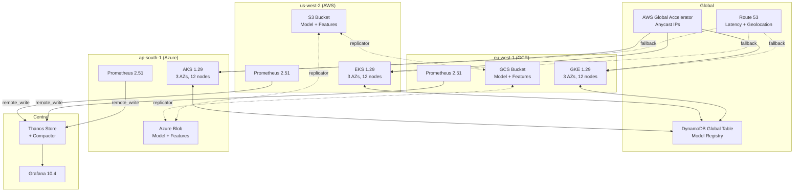
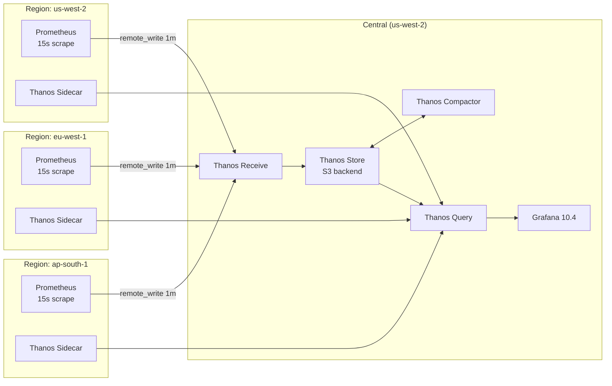
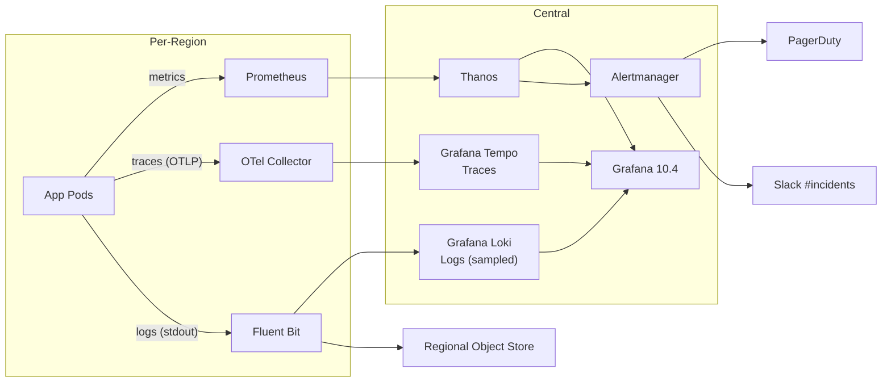

# Architecture: Multi-Region ML Platform

This document describes the architecture of the multi-cloud, multi-region ML serving platform. It is intended for engineers operating or extending the system, and it focuses on decisions that have material operational, cost, or reliability consequences.

The platform spans three regions across three clouds:

| Region        | Cloud  | Cluster     | Primary role                          |
|---------------|--------|-------------|---------------------------------------|
| `us-west-2`   | AWS    | EKS 1.29    | North America serving + control plane |
| `eu-west-1`   | GCP    | GKE 1.29    | EMEA serving + model training         |
| `ap-south-1`  | Azure  | AKS 1.29    | APAC serving + cost-optimized batch   |

---

## 1. Topology Choice: Active-Active vs Active-Passive

We run **active-active across all three regions** for serving traffic. Each region terminates its own users, owns its own observability stack, and can absorb 100% of global traffic at degraded performance for up to 4 hours.

Active-active was chosen over active-passive for these reasons:

- **Failover risk reduction**: an active-passive standby that has never carried real traffic is an unknown quantity. Routine traffic on every region exposes latent problems daily, not at the worst possible moment.
- **Latency**: serving from the user's nearest region cuts P99 by 80-200 ms versus a single-region deployment.
- **Cost amortization**: idle standby capacity is wasted spend. With active-active and well-tuned HPA, the per-region capacity is sized for `0.6 * global_peak`, so total provisioned capacity is `1.8x peak` (handles single-region loss with headroom) instead of the `2.0x peak` an active-passive pair would require.

Tradeoffs that pushed against this decision:

- **Data consistency** is harder. We pay for it with a globally consistent control plane (DynamoDB Global Tables for the model registry) and accept eventual consistency for non-critical paths (logs, metrics).
- **Operational complexity**: three independent clusters to keep in sync. GitOps with Argo CD ApplicationSets is what makes this manageable; see [DEPLOYMENT.md](DEPLOYMENT.md).



---

## 2. Traffic Routing

We use a **two-tier routing stack**: Anycast as the primary, GeoDNS as the fallback. This avoids putting DNS in the critical path of regional failover for the vast majority of traffic.

### 2.1 Tier 1: Anycast (AWS Global Accelerator)

- Two static Anycast IPv4 addresses (`/32`s announced from 100+ AWS PoPs).
- Traffic enters at the closest PoP, then traverses the AWS backbone to the nearest healthy endpoint.
- Endpoint groups: one per region, each pointing to that region's NLB.
- Health checks every 30 seconds; unhealthy endpoint groups are removed within ~30 seconds.

**Why Anycast over GeoDNS for the primary?**

- Failover does not depend on resolver TTL behavior. The Anycast IP is unchanged; only the path inside the AWS backbone changes.
- Defeats DNS-cache stickiness in mobile and corporate networks (see [TROUBLESHOOTING.md §4](TROUBLESHOOTING.md)).
- TLS termination at the regional NLB; Anycast does not terminate, so we keep mTLS end-to-end when needed.

GCP and Azure have analogous services (Cloud Load Balancing, Azure Front Door). We chose Global Accelerator because all three endpoint groups can be registered against it regardless of which cloud they live in—Front Door cannot route to non-Azure backends as cleanly, and GCP Global LB requires GCP-hosted backends.

### 2.2 Tier 2: GeoDNS (Route 53)

- Used by clients that for whatever reason cannot use Anycast (e.g., direct integrations that hard-code DNS).
- **Latency-Based Routing** is the primary, **Geolocation** is the fallback for unmapped IPs.
- Health-check-driven failover with `evaluate_target_health=true`.
- TTL = 60 seconds; the failover controller can drop this to 30 seconds during planned maintenance.

### 2.3 Tier 3: Cluster-internal (Istio)

Within a region, traffic enters the cluster's NLB, terminates TLS at the Istio `IngressGateway`, and routes via `VirtualService`/`DestinationRule` to a `Deployment` selected by header (`x-model-version`, `x-experiment-arm`).

Region-affinity headers (`x-region-preference: eu-west-1`) are honored when the requested region is healthy; otherwise the client receives a `307 Temporary Redirect` to a region-specific hostname.

---

## 3. Data Replication

Data falls into four tiers, each with a different consistency model:

### 3.1 Model Artifacts (Eventually Consistent, ~5 minutes)

- Source of truth: the **model registry** (DynamoDB Global Table). The registry holds metadata (version, checksum, training data hash, signed manifest).
- Binary artifacts live in the regional object store (S3/GCS/Blob).
- The `model_replicator` service (one instance per region) consumes registry change events via DynamoDB Streams and copies the binary from the source region to its local store.
- Reasoning: putting 4 GB model artifacts directly in a globally replicated database is prohibitively expensive. Indirection through a small consistent registry pointing at large per-region blobs gives us strong consistency on the **pointer** and best-effort on the **payload**.

### 3.2 Feature Store (Strong Consistency for Writes, Bounded Staleness for Reads)

- **Online store**: Aurora Global Database with writer in `us-west-2` and read replicas in `eu-west-1` and `ap-south-1`. Reader lag is bounded at <1 second under normal conditions.
- **Offline store**: per-region Parquet on S3/GCS/Blob, regenerated daily from the writer's binlog via Debezium → Kafka MirrorMaker 2 → Iceberg.
- Reads are region-local; writes are forwarded to the writer region. Write latency from `ap-south-1` is ~210 ms (acceptable for the low write rate we see).

If global write performance becomes a constraint, we have a documented migration path to **Spanner** (multi-region instance with `us-asia1` config) at ~3x the cost.

### 3.3 Logs (Eventually Consistent, Region-Local)

- Each region's pods write logs to that region's object store via Fluent Bit → S3/GCS/Blob.
- No cross-region replication; an analyst querying logs queries all three regions in parallel via Athena (S3), BigQuery (GCS), and Azure Data Explorer (Blob), with results merged client-side.
- Retention: 90 days hot, 365 days cold (Glacier/Coldline/Archive tier).

### 3.4 Metrics (Streaming Replication via Thanos)

- Each region runs Prometheus 2.51 with `remote_write` to a central Thanos Receive cluster in `us-west-2`.
- 15-second resolution is downsampled to 1-minute on remote-write to bound egress.
- Thanos Compactor maintains: raw (14 days), 5-minute (90 days), 1-hour (2 years).
- Grafana reads from Thanos Query, which fans out to per-region Thanos Sidecars for hot data and the central store for cold data.



---

## 4. Model Registry Replication

The model registry is the **only globally strongly consistent component** in the system. Everything else is eventually consistent.

Implementation:

- **DynamoDB Global Table v2 (2019.11.21)** spanning `us-east-1`, `eu-west-1`, `ap-south-1`. Writes from any region replicate to the other two within ~1 second.
- Schema:
  ```
  PK: model_name + model_version  (string)
  SK: artifact_kind               (string: "weights"|"config"|"tokenizer")
  attrs: sha256, size_bytes, source_region, promotion_state, signed_manifest_url
  ```
- Conditional writes guard against version regressions: `attribute_not_exists(model_version) OR :new_version > model_version`.

Critically, the registry stores **only metadata**. The binary artifacts live in cloud-native object stores:

- `s3://ml-models-us-west-2/<name>/<version>/`
- `gs://ml-models-eu-west-1/<name>/<version>/`
- `az://ml-models-apsouth1/<name>/<version>/`

The replicator copies binaries cross-region opportunistically. An inference pod that needs a model not yet present locally falls back to fetching from the source region with degraded cold-start latency (typically 8-30 seconds for a 4 GB model over the AWS-GCP private interconnect).

This split—consistent metadata, eventually consistent payload—is the central architectural insight that makes the system tractable. Trying to keep 4 GB model artifacts globally consistent would cost 10-50x more in storage and egress.

---

## 5. Observability Spine



Three signals are correlated by `trace_id` propagated end-to-end via W3C Trace Context headers:

- **Metrics**: Prometheus per-region → Thanos central. Recording rules pre-aggregate high-cardinality dimensions before federation.
- **Traces**: OTel Collector per-region tail-samples at 1% (100% for traces with `error=true`) → Grafana Tempo (S3 backend) in `us-west-2`.
- **Logs**: Full logs to regional object store (cold path). Sampled error-level logs (10%) to Loki for interactive search.

The central observability stack is intentionally **single-region** (`us-west-2`) because:

- Engineers tolerate dashboard unavailability during a region outage; users do not tolerate inference unavailability.
- Cross-region replication of an observability backend would double its cost for minimal benefit during normal operation.
- During a `us-west-2` outage, regional Grafana instances (`grafana.us.ml.example.com` etc.) provide a degraded view of just that region's data.

Alertmanager runs in HA mode (3 replicas across AZs in `us-west-2`). The PagerDuty integration deduplicates by `alertname + region + service` to prevent alert storms during regional outages.

---

## 6. Network Topology

- **AWS**: VPC `10.0.0.0/16` in `us-west-2`, three AZs, public subnets for NLB, private subnets for EKS nodes, isolated subnets for data tier. Transit Gateway connects to peering hub.
- **GCP**: VPC `10.16.0.0/16` in `europe-west1` with Cloud NAT, private GKE cluster.
- **Azure**: VNet `10.32.0.0/16` in `centralindia` with NAT Gateway, private AKS cluster.
- **Inter-region**: AWS Direct Connect Gateway peered to GCP Cloud Interconnect (Megaport partner) and Azure ExpressRoute (Megaport). 1 Gbps committed, burstable to 10 Gbps. Latency `us-west-2 ↔ eu-west-1` ~140 ms, `us-west-2 ↔ ap-south-1` ~220 ms.

CIDR ranges are non-overlapping by design so we can mesh later (Istio multi-cluster) without re-IPing.

---

## 7. Security Boundaries

- **Per-region KMS keys** for at-rest encryption. Cross-region copies are re-encrypted with the destination region's KMS key. No CMK is shared across regions.
- **Workload Identity** everywhere: IRSA on EKS, GKE Workload Identity on GKE, AAD Workload Identity on AKS. No long-lived service-account keys.
- **mTLS via Istio** for east-west traffic within each region. Cross-region traffic terminates TLS at the destination NLB and re-encrypts to the destination pod.
- **Network policies** (Cilium on EKS/GKE, Azure Network Policy on AKS) deny-by-default. Explicit allow-list for inter-service traffic.
- **Secrets**: distributed via External Secrets Operator pulling from AWS Secrets Manager (`us-west-2`), GCP Secret Manager (`eu-west-1`), Azure Key Vault (`ap-south-1`). Secrets are replicated cross-region at the operator's cache layer; the source-of-truth lives in the region's native secret store.

---

## 8. Capacity Planning

- Sized for `global_peak = 12,000 req/s` (recommendation traffic, dominant).
- Per-region steady state: 4,000 req/s, 12 inference pods × 4 cores × 16 GB.
- Single-region failure scenario: surviving regions absorb 6,000 req/s each. HPA scales from 12 → 24 pods in ~3 minutes; cluster autoscaler adds nodes in ~5 minutes.
- During the 5-minute autoscale gap, we accept up to 5% throttled requests via `429 Too Many Requests` with a `Retry-After` header.

Cost model (per month, steady-state):

| Component                  | Cost (USD) |
|----------------------------|------------|
| EKS + EC2 (us-west-2)      | $4,200     |
| GKE + GCE (eu-west-1)      | $3,900     |
| AKS + Azure VM (ap-south-1) | $3,400    |
| Inter-cloud egress         | $1,800     |
| Object storage             | $600       |
| Global Accelerator         | $180       |
| Route 53                   | $20        |
| Observability stack        | $1,100     |
| **Total**                  | **~$15,200** |

A single-region deployment of equivalent capacity would cost ~$10,500/month, so the multi-region tax is ~45%, balanced against an availability uplift from 99.9% (single-region) to 99.95% (target) and a 99.99% measured (Q1 2026).

---

## 9. Failure Modes Considered

The architecture defends against:

- **Single AZ failure**: handled at the cluster level via multi-AZ node groups.
- **Single region failure**: handled by Anycast/GeoDNS failover to other regions.
- **Single cloud failure**: handled by spanning three clouds; loss of any one preserves capacity in the other two.
- **Cross-region network partition**: each region operates independently with stale data until the partition heals; the model registry's conditional writes prevent split-brain version promotions.
- **Operator error**: GitOps means all changes flow through pull requests; manual `kubectl apply` is detected by Argo CD as drift and reverted within 3 minutes (auto-prune enabled in staging, disabled in prod with an alert instead).

The architecture **does not defend** against:

- A bug in a model artifact that produces toxic output. This is handled by model validation gates in CI/CD, not by infrastructure.
- A coordinated attack that compromises credentials in all three clouds. We rely on cloud-provider security and least-privilege IAM.
- A global DDoS exceeding 100 Gbps. AWS Shield Advanced is purchased; mitigations beyond that require coordination with the provider.
